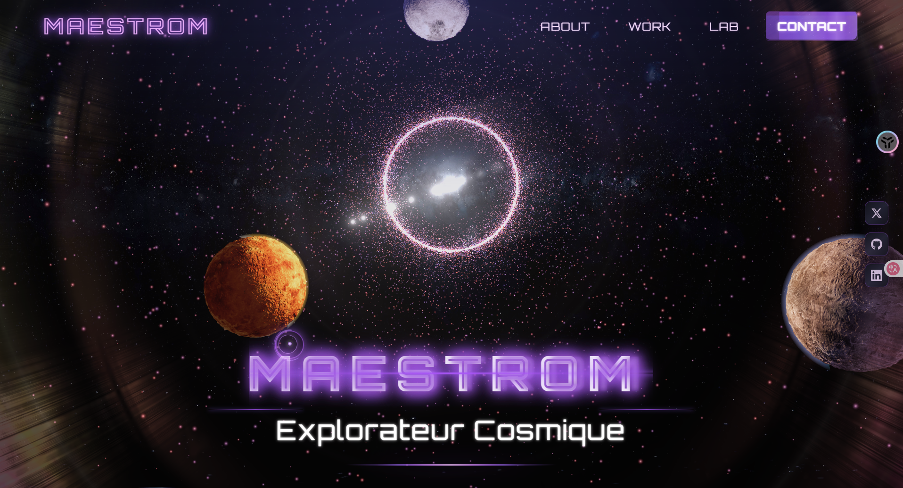
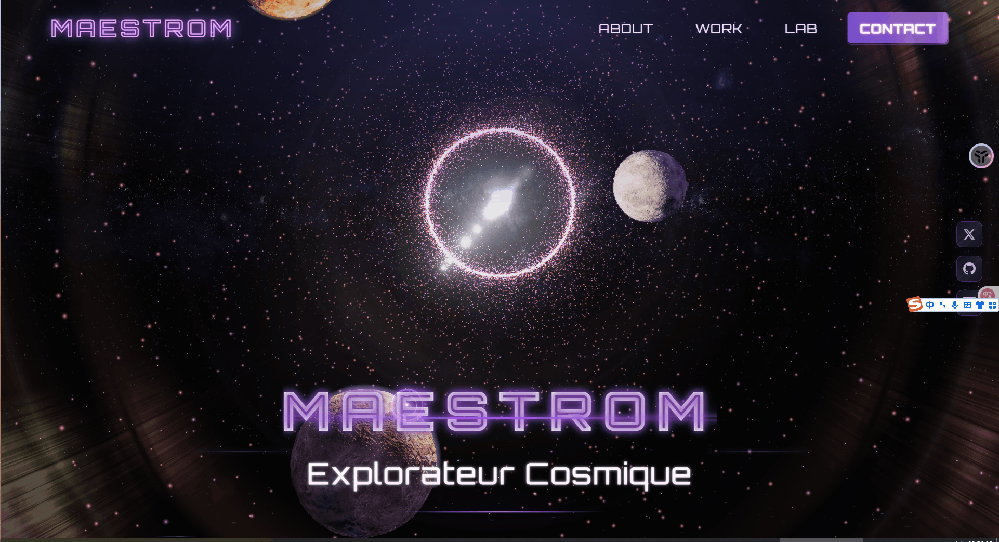

# MAESTROM — 宇宙探索者

> 一个基于 Three.js + Vue 3 构建的沉浸式 3D 宇宙主题交互网站
## Page 预览



**[在线演示][demo]** | **[报告问题][issues]** | **[功能建议][issues]**

---

## 📖 项目简介

**MAESTROM**（宇宙探索者）是一个创新的 3D 交互式网站项目，将 WebGL 技术与现代前端框架相结合，创造出一个令人惊叹的宇宙主题视觉体验。项目采用 Three.js 构建 3D 场景，结合 Vue 3 构建用户界面，通过自定义着色器实现丰富的视觉效果。

### 核心特色

- 🌌 **沉浸式宇宙场景**：包含完整的星系系统、行星系统和星空背景
- ✨ **镜头光晕效果**：基于着色器实现的高质量镜头光晕效果
- 🪐 **动态行星系统**：多行星系统，支持自定义材质和大气层效果
- 🎨 **自定义着色器**：丰富的 GLSL 着色器实现各种视觉效果
- 🎯 **现代化架构**：采用单例模式和经验架构，代码结构清晰易维护
- 🛠️ **完善的调试工具**：集成 Tweakpane 调试面板，实时调整参数
- 🎭 **交互式 UI**：科技风格的用户界面，支持响应式设计

---

## 🚀 快速开始

### 环境要求

- **Node.js** >= 16.x
- **包管理器**：npm、pnpm 或 yarn（推荐使用 pnpm）

### 安装依赖

```bash
# 使用 npm
npm install

# 使用 pnpm（推荐）
pnpm install

# 使用 yarn
yarn install
```

### 开发模式

启动开发服务器：

```bash
npm run dev
# 或
pnpm dev
# 或
yarn dev
```

开发服务器默认运行在 `http://localhost:5173`（可通过配置文件修改）

### 构建生产版本

```bash
npm run build
# 或
pnpm build
# 或
yarn build
```

### 预览生产版本

```bash
npm run preview
# 或
pnpm preview
# 或
yarn preview
```

---

## 🛠️ 技术栈

### 核心框架

- **[Three.js](https://threejs.org/)** `^0.172.0` - 3D 图形渲染引擎
- **[Vue 3](https://vuejs.org/)** `^3.5.13` - 渐进式 JavaScript 框架
- **[Vite](https://vitejs.dev/)** `^5.4.0` - 下一代前端构建工具

### 状态管理与通信

- **[Pinia](https://pinia.vuejs.org/)** `^3.0.2` - Vue 的状态管理库
- **[mitt](https://github.com/developit/mitt)** - 轻量级事件总线（用于 Vue 与 Three.js 层通信）

### 工具库

- **[GSAP](https://greensock.com/gsap/)** `^3.12.5` - 动画库
- **[Cannon.js](https://github.com/schteppe/cannon.js)** `^0.6.2` - 物理引擎
- **[maath](https://github.com/pmndrs/maath)** `^0.10.8` - 数学工具库
- **[Tweakpane](https://tweakpane.github.io/)** `^4.0.5` - 参数调试面板

### 样式与构建

- **[TailwindCSS](https://tailwindcss.com/)** `^3.4.9` - 实用优先的 CSS 框架
- **[SASS](https://sass-lang.com/)** `^1.77.8` - CSS 预处理器
- **[vite-plugin-glsl](https://github.com/UstymUkhman/vite-plugin-glsl)** `^1.3.0` - GLSL 着色器支持

### 开发工具

- **[ESLint](https://eslint.org/)** - 代码质量检查
- **[Prettier](https://prettier.io/)** - 代码格式化
- **[Husky](https://typicode.github.io/husky/)** - Git 钩子管理
- **[Commitlint](https://commitlint.js.org/)** - 提交信息规范
- **[Playwright](https://playwright.dev/)** - 端到端测试

---

## 📁 项目结构

```
vite-three-js/
├── src/
│   ├── js/                          # Three.js 核心代码
│   │   ├── experience.js            # 经验类（单例模式，核心入口）
│   │   ├── camera.js                # 相机管理
│   │   ├── renderer.js              # 渲染器管理
│   │   ├── sources.js               # 资源列表定义
│   │   ├── components/              # 3D 组件
│   │   │   ├── LensFlare.js        # 镜头光晕效果
│   │   │   ├── text-mesh.js        # 3D 文字网格
│   │   │   ├── float.js            # 浮动动画组件
│   │   │   ├── glass-wall.js       # 玻璃墙效果
│   │   │   └── center.js           # 居中组件
│   │   ├── utils/                   # 工具类
│   │   │   ├── debug.js            # 调试面板
│   │   │   ├── resources.js        # 资源加载器
│   │   │   ├── time.js             # 时间控制器
│   │   │   ├── sizes.js            # 尺寸管理
│   │   │   ├── imouse.js           # 鼠标跟踪
│   │   │   ├── stats.js            # 性能监控
│   │   │   └── event-emitter.js    # 事件发射器
│   │   ├── world/                   # 世界场景
│   │   │   ├── world.js            # 世界主类
│   │   │   ├── environment.js      # 环境设置
│   │   │   ├── galaxy.js           # 星系效果
│   │   │   ├── planets.js          # 行星系统
│   │   │   ├── planet.js           # 单个行星组件
│   │   │   └── physics-world.js    # 物理世界
│   │   └── tools/                   # 工具函数
│   ├── shaders/                     # GLSL 着色器文件
│   │   ├── atmosphere/             # 大气层着色器
│   │   ├── lensflare/              # 镜头光晕着色器
│   │   ├── planet/                 # 行星着色器
│   │   ├── star/                   # 星星着色器
│   │   ├── glass/                  # 玻璃效果着色器
│   │   ├── halftone/               # 半色调着色器
│   │   └── includes/               # 着色器公共函数
│   ├── components/                 # Vue 组件
│   │   └── TechCursor.vue          # 科技风鼠标光标
│   ├── css/                        # 全局样式
│   ├── scss/                       # SASS 样式文件
│   ├── assets/                     # 静态资源
│   └── App.vue                     # Vue 根组件
├── public/                         # 公共资源
│   ├── textures/                  # 纹理资源
│   │   ├── galaxy/                # 星系纹理
│   │   ├── lensflare/             # 镜头光晕纹理
│   │   └── environmentMap/        # 环境贴图
│   └── fonts/                     # 字体文件
├── vite.config.js                 # Vite 配置文件
├── tailwind.config.cjs            # Tailwind 配置
└── package.json                   # 项目依赖配置
```

---

## 🎯 核心功能说明

### 1. Experience 单例模式

项目采用单例模式管理 Three.js 核心组件，确保全局只有一个 `Experience` 实例。所有 3D 组件通过 `new Experience()` 获取共享资源：

```javascript
import Experience from './experience.js'

export default class YourComponent {
  constructor() {
    this.experience = new Experience()
    this.scene = this.experience.scene
    this.camera = this.experience.camera.instance
    this.renderer = this.experience.renderer.instance
    // ... 其他共享资源
  }
}
```

### 2. 资源管理系统

所有资源在 `src/js/sources.js` 中统一定义，`Resources` 类会根据资源类型自动选择合适的加载器：

- `gltfModel` - GLTF 模型加载器
- `texture` - 纹理加载器
- `cubeTexture` - 立方体贴图加载器
- `font` - 字体加载器
- `fbxModel` - FBX 模型加载器
- 等等...

### 3. 行星系统

项目实现了完整的行星系统，包含：
- 多行星渲染（支持自定义材质）
- 大气层效果（基于着色器实现）
- 行星自转和公转动画
- 可自定义的行星参数（大小、速度、颜色等）

### 4. 镜头光晕效果

基于 GLSL 着色器实现的高质量镜头光晕效果，支持：
- 多光源光晕
- 可配置的光晕强度和颜色
- 镜头污垢纹理效果

### 5. Vue 与 Three.js 通信

项目采用 **Pinia + mitt** 的双重通信机制：

- **Pinia**：用于全局状态同步（如当前模式、选中对象等）
- **mitt**：用于事件通知（如弹窗、动画完成等即时事件）

### 6. 调试面板

集成 Tweakpane 调试面板，开发模式下可以实时调整：
- 场景参数
- 材质属性
- 动画参数
- 相机设置
- 等等...

---

## 🎨 自定义着色器

项目包含丰富的自定义着色器实现：

- **大气层着色器** (`atmosphere/`) - 实现行星大气层效果
- **镜头光晕着色器** (`lensflare/`) - 实现镜头光晕和光斑效果
- **行星着色器** (`planet/`) - 实现行星表面材质和光照
- **星星着色器** (`star/`) - 实现星空粒子效果
- **玻璃着色器** (`glass/`) - 实现玻璃材质效果
- **半色调着色器** (`halftone/`) - 实现半色调艺术效果

所有着色器文件支持通过 `vite-plugin-glsl` 直接导入：

```javascript
import fragmentShader from '../shaders/planet/fragment.glsl'
import vertexShader from '../shaders/planet/vertex.glsl'
```

---

## 🧩 开发指南

### 创建新的 3D 组件

1. 在 `src/js/components/` 或 `src/js/world/` 下创建新的组件类
2. 通过 `Experience` 单例获取所需资源
3. 实现 `update()` 方法（如有动画或更新逻辑）
4. 实现 `resize()` 方法（如需要响应窗口大小变化）
5. 实现 `debugInit()` 方法（添加调试面板）

示例：

```javascript
import Experience from '../experience.js'

export default class MyComponent {
  constructor() {
    this.experience = new Experience()
    this.scene = this.experience.scene
    this.debug = this.experience.debug

    // 组件初始化逻辑
    this.setup()

    if (this.debug.active) {
      this.debugInit()
    }
  }

  setup() {
    // 创建 3D 对象
  }

  debugInit() {
    const folder = this.debug.ui.addFolder({
      title: 'My Component',
      expanded: true,
    })
    // 添加调试控件
  }

  update() {
    // 更新逻辑
  }

  resize() {
    // 响应式调整
  }
}
```

### 添加新资源

在 `src/js/sources.js` 中添加资源定义：

```javascript
{
  name: 'myTexture',
  type: 'texture',
  path: 'textures/my-texture.jpg',
}
```

然后在组件中通过 `this.experience.resources.items['myTexture']` 访问。

### 使用事件总线

Vue 层与 Three.js 层通过 mitt 事件总线通信：

```javascript
// Vue 组件中
import emitter from '@/js/utils/event-bus.js'
emitter.emit('ui:toggle-menu', { open: true })

// Three.js 组件中
import emitter from './utils/event-bus.js'
emitter.on('ui:toggle-menu', (data) => {
  // 处理事件
})
```

---

## 📝 代码规范

### 命名规范

- **类文件**：使用大驼峰命名（如 `LensFlare.js`）
- **工具函数**：使用小驼峰命名
- **常量**：使用大写字母和下划线

### 注释规范

- 所有关键逻辑需添加中文注释
- 复杂函数需注释参数和返回值
- 类方法需注释功能说明

### 提交规范

项目使用 [Conventional Commits](https://www.conventionalcommits.org/) 规范：

- `feat:` - 新功能
- `fix:` - 修复问题
- `docs:` - 文档更新
- `style:` - 代码格式调整
- `refactor:` - 代码重构
- `test:` - 测试相关
- `chore:` - 构建/工具相关

---

## 🌐 浏览器支持

项目支持现代浏览器，包括：

| Chrome | Firefox | Edge | Opera | Safari |
| :----: | :-----: | :--: | :---: | :----: |
|   ✅   |   ✅    |  ✅  |  ✅   |   ✅   |

支持 **92.3%** 的浏览器覆盖率。如需调整支持范围，请修改 `.browserslistrc` 文件。

---

## 📚 相关资源

- [Three.js 官方文档](https://threejs.org/docs/)
- [Vue 3 官方文档](https://vuejs.org/)
- [Vite 官方文档](https://vitejs.dev/)
- [GLSL 着色器教程](https://thebookofshaders.com/)

---

## 🤝 贡献指南

欢迎贡献代码！请遵循以下步骤：

1. Fork 本仓库
2. 创建功能分支：`git checkout -b feat/your-feature`
3. 提交更改：`git commit -m 'feat: Add some feature'`
4. 推送到分支：`git push origin feat/your-feature`
5. 提交 Pull Request

### 贡献类型

- 🐛 **Bug 修复**：创建 `fix/` 分支
- ✨ **新功能**：创建 `feat/` 分支
- 📝 **文档更新**：创建 `docs/` 分支
- 🎨 **样式改进**：创建 `style/` 分支
- ♻️ **代码重构**：创建 `refactor/` 分支

---

## 📄 许可证

本项目采用 [MIT 许可证][license] 开源。

所有商标和徽标均为其各自所有者的财产。

---

## 🙏 致谢

特别感谢以下项目和工具：

- [Three.js](https://threejs.org/) - 强大的 3D 图形库
- [Vue.js](https://vuejs.org/) - 渐进式 JavaScript 框架
- [Vite](https://vitejs.dev/) - 下一代前端构建工具
- [Tweakpane](https://tweakpane.github.io/) - 优秀的参数调试工具

---

## 📮 联系方式

如有问题或建议，欢迎通过以下方式联系：

- 📧 **Email**: [doinel1atanasiu@gmail.com](mailto:doinel1atanasiu@gmail.com)
- 🌐 **Website**: [business-link.d1a.app](https://business-link.d1a.app)
- 🐛 **Issues**: [GitHub Issues][issues]

---

**Made with ❤️ by [Doinel Atanasiu](https://github.com/doinel1a)**

[node]: https://nodejs.org/en
[yarn]: https://yarnpkg.com
[pnpm]: https://pnpm.io
[demo]: https://vite-three-js.d1a.app
[license]: https://github.com/doinel1a/vite-three-js/blob/main/LICENSE
[code-of-conduct]: https://github.com/doinel1a/vite-three-js/blob/main/CODE_OF_CONDUCT.md
[issues]: https://github.com/doinel1a/vite-three-js/issues
[pulls]: https://github.com/doinel1a/vite-three-js/pulls
[browserslist]: https://browsersl.ist/#q=last+3+versions%2C%3E+0.2%25%2C+not+dead
