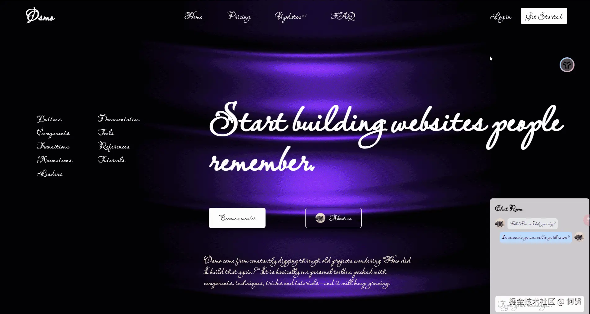
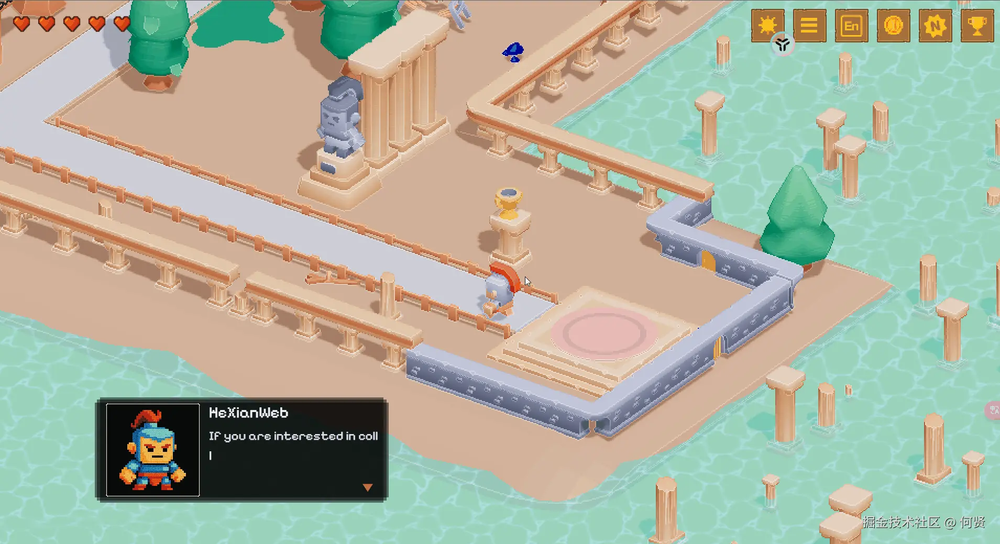

# 2.5D 像素风 Three.js 个人简历网站 ✨



## 📖 项目简介 | Project Introduction

本项目是一个基于 Three.js 的 2.5D 像素风格交互式个人简历网站，通过游戏化方式展示个人信息、项目经历和技能，兼顾趣味性与实用性，优先优化移动端体验。
This project is an interactive 2.5D pixel-style resume website built with Three.js, gamifying the presentation of personal info, projects, and skills, with a mobile-first approach.



---

## ✨ 主要特性 | Key Features

- 🕹️ **2.5D 像素风场景 / 2.5D Pixel Art Scene**：独特的像素化 3D 场景，沉浸式体验。
  Unique pixelated 3D scene for immersive experience.
- 🧑‍💻 **角色模型与移动 / Character Control**：用户可控制像素角色在场景中自由移动。
  Control a pixel character to explore the scene.
- 💬 **对话框交互 / Dialog Interaction**：靠近特定物体或 NPC 时自动弹出对话框，展示个人简介、项目介绍、技能说明等。
  Dialogs pop up near objects/NPCs to show info.
- 🎁 **收集元素系统 / Collectibles System**：场景中分布可收集物品，代表技能或项目，收集后可在 UI 查看。
  Collect items representing skills/projects.
- 🏆 **成就系统 / Achievement System**：设定成就目标，达成后获得徽章或称号，提升互动乐趣。
  Unlock badges/titles by achieving goals.
- 🌗 **日夜切换 / Day-Night Switch**：支持一键切换场景白天/夜晚效果。
  Switch between day and night scenes.
- 📱 **响应式设计 / Responsive Design**：适配桌面与移动端，优先优化触摸操作与加载速度。
  Fully responsive, optimized for mobile.

---

## 🚀 快速开始 | Getting Started

### 环境要求 / Requirements
- Node.js
- 推荐使用 Yarn 或 PNPM / Yarn or PNPM recommended

### 安装依赖 / Install Dependencies
```bash
yarn install
# 或 or
npm install
```

### 启动开发服务器 / Start Dev Server
```bash
yarn dev
# 或 or
npm run dev
```

### 构建生产环境 / Build for Production
```bash
yarn build
# 或 or
npm run build
```

---

## 🛠️ 技术栈 | Tech Stack

- Three.js  —— 3D 渲染核心库 / 3D rendering core
- Vite  —— 极速前端构建工具 / Fast frontend build tool
- TailwindCSS  —— 原子化 CSS 框架 / Utility-first CSS
- SASS/PostCSS  —— CSS 预处理 / CSS preprocessors
- ESLint/Prettier  —— 代码规范与格式化 / Lint & format
- Playwright  —— 端到端自动化测试 / E2E testing
- Husky/Commitlint  —— Git 提交规范 / Git hooks & commit lint

---

## 🚩 开发阶段 / Milestones

1. 🏗️ 基础场景搭建、角色模型与移动、日夜切换原型、对话框静态 UI（已完成）  
   Basic scene, character, day/night, dialog UI (done)
2. 💬 对话框交互逻辑（已完成）  
   Dialog interaction logic (done)
3. 🎁 收集元素系统及其 UI（开发中）  
   Collectibles system & UI (in progress)
4. 🏆 成就系统及其 UI  
   Achievement system & UI
5. 📱 全面响应式设计，移动端优化  
   Full responsive design, mobile optimization
6. 📝 内容填充与测试  
   Content & testing

---

## 📱 移动端优化 | Mobile Optimization

- 使用 CSS 媒体查询自适应不同屏幕尺寸，特别优化小屏幕体验。
  CSS media queries for all screens, mobile-first.
- 所有交互按钮和 UI 元素均适配触摸操作。
  Touch-friendly UI elements.
- 优化资源加载，提升移动端访问速度。
  Optimized asset loading for speed.

---

## 🤝 贡献指南 | Contribution Guide

欢迎任何形式的贡献！  
All contributions are welcome!

1. Fork 本仓库并创建新分支 / Fork & create a new branch
2. 提交更改并发起 Pull Request / Commit & open a PR
3. 遵循规范的提交信息格式 / Use conventional commit messages

---

## 📝 License

MIT

---

> 本项目灵感来源于像素风游戏与创意简历，欢迎交流与建议！  
> Inspired by pixel games & creative resumes. Feedback welcome!
